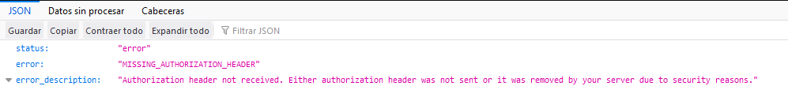

# Tec-MAS Flutter


**Sistema informativo de comunicación y difusión para la comunidad del TecNM/ITM**

*Seguimos trabajando en el nombre*

------

### ¿Qué es Tec-Mas?

Tec-MAS pretende ser un medio de comunicación y difusión de información entre la institución educativa TecNM/ITM y su comunidad Institucional, permitiendo ofrecer la información importante y de relevancia académica de la forma mas oportuna y rápida posible.

------

### Notas del Desarrollador:

La versión actual incorpora ya con sistema de seguridad en el backend, esto utilizando el plugin:

- ```
  WordPress REST API Authentication
  ```

Por ende las solicitudes a la api de wordpress han sido bloqueadas a menos que se envié junto con la petición http las credenciales correspondientes.

 <p align="center"> </p>
Además se incorpora el servicio de notificaciones de OneSignal, sin embargo tenemos ciertos bugs o contratiempos:

* El servicio incorporado intenta abrir el navegador predefinido del equipo, comportamiento que deseamos modificar para que abra la aplicación y muestre el contenido del post en la misma. Este comportamiento no se a podido incorporar hasta el momento debido a:

  	* No hemos encontrado hasta el momento una forma de reabrir la aplicación en caso de estar cerrada. En caso de estar abierta los test demuestran que seria posible incorporar el comportamiento, sin embargo no es lo que se desea.

Por lo pronto las notificaciones son recibidas pero al intentar abrirlas solo se eliminan del panel de notificaciones.

**Cosas por hacer:**

* Mejorar el diseño (se, no me sigue gustando).
* Ajustar ciertos detalles en la sección de transporte (en funcionamiento interno, en cuanto a datos guardados en el cache).
* Resolver un pequeño bug en la vista del calendario (corregir el disparo de una excepción)
* Instruirme en el manejo de bases SQLite en flutter e implementar mejoras en la carga de contenido, rendimiento y funcionalidades.

**Resuelto pero en revisión:**

* Resolver un pequeño bug visual en el apartado de inicio (al momento de recargar mientras se solicitan artículos al mismo tiempo).

*Cosas por hacer de forma personal:*

De la rama TecMAS-19-11-18-(Lector-de-Articulos) a las anteriores necesito agregar comentarios de cambios por versión.

**Capturas de Pantalla:**

<p align="center"></p>
<p align="center"></p>
<p align="center"></p>
<p align="center"></p>
<p align="center"></p>
<p align="center"></p>
<p align="center"></p>
<p align="center"></p>
<p align="center"></p>
### Mapa Interactivo:

El desarrollo del apartado mapa interactivo corresponde a un entorno de realidad aumentada que permita de una forma interactiva, visitar y observar el campus institucional. Sin embargo este proyecto no corresponde totalmente a nuestro equipo de trabajo, por lo tanto si los desarrolladores permiten en posteriores versiones presentaremos el link del repositorio en este apartado.