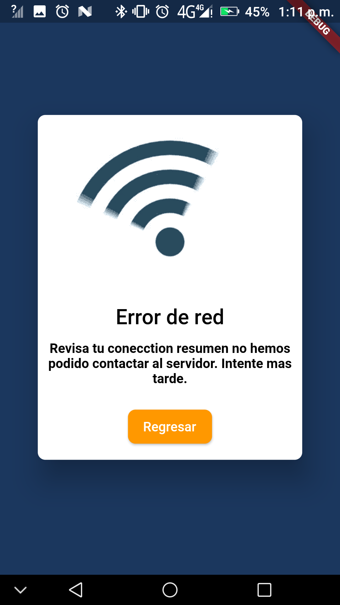

Esta versión incluye "mejoras graficas" como mensajes en cuadros de dialogo que remplazan a los anteriores mensajes de error en las secciónes del lector de notificaciones y el la vista de artículos, también se han corregido ciertos bugs relevantes a la vista de arituclos y se ha modificado la forma en que se ven ciertos artículos en su referente lector.

Subo esta rama a github como medio de recuperación y para posteriormente sincronizar con mi escritorio en windows (esta versión fue depurada en Linux Lite).

En fin, se continuan con mejoras para hacer mas fluido el lector pdf del calendario.

**Capturas:**

 

 

 

 

 

 

 

 

